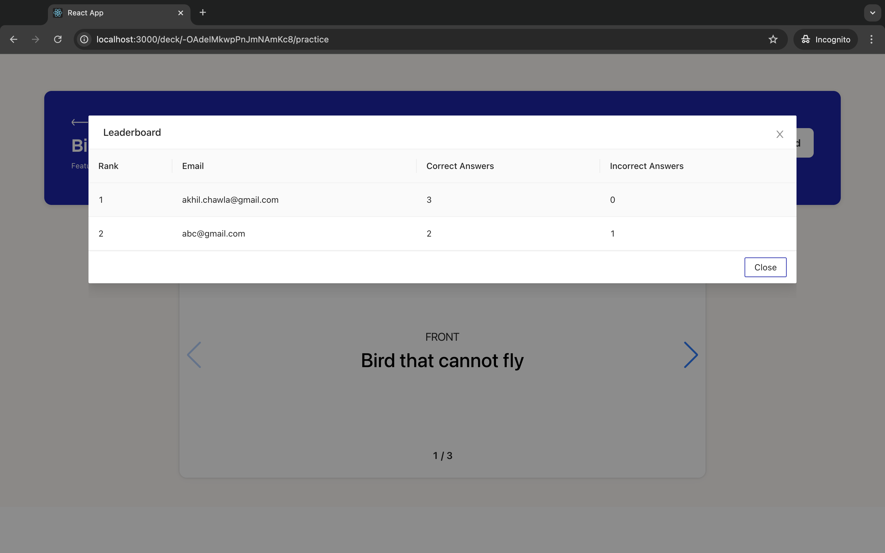

  

  
  
  

<a href="https://github.com/CSC-510-Group-19/FlashCards/actions/workflows/codecov.yml" alt="Codecov">
 </a>

## Description
Are you a student and having trouble preparing for tests and exams? Look no further. FlashCards also helps you memorize all that hard-to-remember information with online flashcards so that you ace your exams!

FlashCards is a spaced repetition learning platform to <b>create</b>, <b>memorize</b> and <b>share</b> your knowledge list using flashcards.

1. Create folders
2. Add decks to folder
3. Decks in folder redirected to Practice Deck
4. Leaderboard
5. Quiz Mode
6. Recently visited Decks

## Watch Flashcards in Action
[Watch FlashCards Video](./images/FlashCards-2.mp4)

[NEW AND IMPROVED](https://youtu.be/mA2UEmUs2Nk)

Screenshots

  
  
  
  
  
  
  
  
  
  
  

## Tech Stack

## Getting started & Installation:
- Backend [See README.md](backend/Readme.md)
- Frontend [See README.md](frontend/README.md)

## New Features
- Enhanced endpoint security
- OAuth Integration (Sign in with Google, GitHub, or Facebook)
- Folder Management

<!-- ## Future Roadmap [See here](https://github.com/users/CSC-510-Group-19/projects/1) -->

## Suggested Future Features (see [poster](https://github.com/CSC-510-Group-19/FlashCards/blob/main/images/Poster_Project2.pdf) for more information)
- [ ] Add a folder deletion function
- [ ] Improve API Authentication
- [ ] Improve Sign-up and Log-in Options
- [ ] Use LLM for Automatic Flashcard Creation
- [ ] Add More Study Goals

<!-- ### Phase 1:
- [ ] Add a dashboard providing insights on study habits, quiz results over time, and areas needing improvement, helping users to plan their study strategy.
- [ ] Enable collaborative learning by enabling users to share flashcards seamlessly with friends, classmates, or study groups
- [ ] Progress tracking by subject and review options like retrying incorrect questions
- [ ] Chrome Extension feature that enables users to highlight text on websites or online PDFs and instantly create flashcards from their selections.-->

## Contributions to the Project
Please refer to the [Contributing.md](Contributing.md) if you want to contrbute to the FlashCards source code. Follow all the guidelines mentioned and raise a pull request for the developers to review before the code goes to the main source code.

## Help

Email any queries to the contributors -
1. [Jonathan Kurian](jgkurian@ncsu.edu)
2. [Eleanor Maye](edmaye@ncsu.edu)
3. [Mulikatu Yakubu](Miyakubu@ncsu.edu)

## Authors 

1. [Jonathan Kurian](jgkurian@ncsu.edu)
2. [Eleanor Maye](edmaye@ncsu.edu)
3. [Mulikatu Yakubu](Miyakubu@ncsu.edu)

# Rubric

| Total                                                                                                                                                                                                                                              | 105   |                                                                                                                                                                                                                                                     |
| -------------------------------------------------------------------------------------------------------------------------------------------------------------------------------------------------------------------------------------------------- | ----- | --------------------------------------------------------------------------------------------------------------------------------------------------------------------------------------------------------------------------------------------------- |
| Notes                                                                                                                                                                                                                                              | Grade | Evidence                                                                                                                                                                                                                                            |
| Workload is spread over the whole team (one team member is often X times more productive than the others…                                                                                                                                          | 3     | [Commits](https://github.com/CSC-510-Group-19/FlashCards/tree/bug/folder_decks)                                                                                                                                                                     |
| but nevertheless, here is a track record that everyone is contributing a lot)                                                                                                                                                                      | 3     | [Commits](https://github.com/CSC-510-Group-19/FlashCards/tree/bug/folder_decks)                                                                                                                                                                     |
| Number of commits                                                                                                                                                                                                                                  | 3     | Number of commits [here](https://github.com/CSC-510-Group-19/FlashCards/commits/bug/folder_decks/)                                                                                                                                                  |
| [1] [2] [3] Number of commits: by different people                                                                                                                                                                                                 | 3     | [Commits](https://github.com/CSC-510-Group-19/FlashCards/commits/bug/folder_decks/)                                                                                                                                                                 |
| Issues reports: there are many issues                                                                                                                                                                                                              | 3     | [Issues](https://github.com/CSC-510-Group-19/FlashCards/issues)                                                                                                                                                                                     |
| Issues are being closed                                                                                                                                                                                                                            | 3     | [Issues_Closed](https://github.com/CSC-510-Group-19/FlashCards/issues)                                                                                                                                                                              |
| Docs: doco generated, format not ugly                                                                                                                                                                                                              | 3     | [Readme](https://github.com/CSC-510-Group-19/FlashCards/tree/develop?tab=readme-ov-file#readme)                                                                                                                                                     |
| Docs: what: point descriptions of each class/function (in isolation)                                                                                                                                                                               | 3     |                                                                                                                                                                                                                                               |
| Docs: how: for common use cases X,Y,Z mini-tutorials showing worked examples on how to do X,Y,Z[4] [5]                                                                                                                                             | 3     |                                                                                                                                                                                                                                                     |
| Docs: why: docs tell a story, motivate the whole thing, deliver a punchline that makes you want to rush out and use the thing                                                                                                                      | 3     | [Readme](https://github.com/CSC-510-Group-19/FlashCards/tree/develop?tab=readme-ov-file#readme)                                                                                                                                                     |
| Docs: short video, animated, hosted on your repo. That convinces people why they want to work on your code.                                                                                                                                        | 3     |                                                                                                                                                                                                                                                     |
| Use of version control tools                                                                                                                                                                                                                       | 3     | Github                                                                                                                                                                                                                                              |
| Test cases exist                                                                                                                                                                                                                                   | 3     | Test                                                                                                                                                                                                                                                |
| Test cases are routinely executed                                                                                                                                                                                                                  | 3     |                                                                                                                                                                                                                                                     |
| Issues are discussed before they are closed                                                                                                                                                                                                        | 3     | [Issues_closed](https://github.com/CSC-510-Group-19/FlashCards/issues)                                                                                                                                                                              |
| Chat channel: exists                                                                                                                                                                                                                               | 3     |                                                                                                                                                                                                                                                     |
| Test cases: a large proportion of the issues related to handling failing cases.                                                                                                                                                                    | 3     | https://github.com/CSC-510-Group-19/FlashCards/issues                                                                                                                                                                                               |
| Evidence that the whole team is using the same tools: everyone can get to all tools and files                                                                                                                                                      | 3     | Demo                                                                                                                                                                                                                                                |
| Evidence that the whole team is using the same tools (e.g. config files in the repo, updated by lots of different people)                                                                                                                          | 3     | Demo                                                                                                                                                                                                                                                |
| Evidence that the whole team is using the same tools (e.g. tutor can ask anyone to share screen, they demonstrate the system running on their computer)                                                                                            | 3     | Demo                                                                                                                                                                                                                                                |
| Evidence that the members of the team are working across multiple places in the code base                                                                                                                                                          | 3     | [Commits](https://github.com/CSC-510-Group-19/FlashCards/tree/auth-ui)                                                                                                                                                                              |
| Short release cycles                                                                                                                                                                                                                               | 3     |                                                                                                                                                                                                                                                     |
| The file .gitignore lists what files should not be saved to the repo. See [examples]i([https://github.com/github/gitignore](https://github.com/github/gitignore))                                                                                  | 3     |                                                                                                                                                                                                                                                     |
| The file INSTALL.md lists how to install the code                                                                                                                                                                                                  | 3     | [README](https://github.com/CSC-510-Group-19/FlashCards/tree/auth-ui?tab=readme-ov-file#readme)                                                                                                                                                     |
| The file LICENSE.md lists rules of usage for this repo                                                                                                                                                                                             | 3     | [License](https://github.com/CSC-510-Group-19/FlashCards/blob/main/LICENSE)                                                                                                                                                                         |
| The file CODE-OF-CONDUCT.md lists rules of behavior for this repo; e.g. see [example](https://github.com/probot/template/blob/master/CODE_OF_CONDUCT.md)                                                                                           | 3     | [README_Doc](https://github.com/CSC-510-Group-19/FlashCards/tree/auth-ui?tab=readme-ov-file#readme)                                                                                                                                                 |
| The file CONTRIBUTING.md lists coding standards and lots of tips on how to extend the system without screwing things up; e.g. see [example](https://github.com/probot/template/blob/master/CONTRIBUTING.md)                                        | 3     | [CODE_OF_CONDUCT](https://github.com/CSC-510-Group-19/FlashCards/tree/auth-ui?tab=coc-ov-file#readme)                                                                                                                                               |
| The file README.md contains all the following                                                                                                                                                                                                      | 3     | [README_Document](https://github.com/CSC-510-Group-19/FlashCards/tree/auth-ui?tab=readme-ov-file#readme)                                                                                                                                            |
| Video                                                                                                                                                                                                                                              | 3     |                                                                                                                                                                                                                                                     |
| DOI badge: exists. To get a Digital Object Identifier, register the project at [Zenodo](https://docs.github.com/en/repositories/archiving-a-github-repository/referencing-and-citing-content). DOI badges look like this:                          | 3     | In Github                                                                                                                                                                                                                                           |
| Badges showing your style checkers                                                                                                                                                                                                                 | 3     |  

 [README](https://github.com/CSC-510-Group-19/FlashCards/tree/auth-ui?tab=readme-ov-file#readme)                                                                                                                                              |
| Badges showing your code formatters.                                                                                                                                                                                                               | 3     | [README](https://github.com/CSC-510-Group-19/FlashCards/tree/auth-ui?tab=readme-ov-file#readme)                                                                                                                                                     |
| Badges showing your syntax checkers.                                                                                                                                                                                                               | 3     | [README](https://github.com/CSC-510-Group-19/FlashCards/tree/auth-ui?tab=readme-ov-file#readme)                                                                                                                                                     |
| Badges showing your code coverage tools                                                                                                                                                                                                            | 3     | [README](https://github.com/CSC-510-Group-19/FlashCards/tree/auth-ui?tab=readme-ov-file#readme)                                                                                                                                                     |
| Badges showing any other Other automated analysis tools                                                                                                                                                                                            | 3     | [README](https://github.com/CSC-510-Group-19/FlashCards/tree/auth-ui?tab=readme-ov-file#readme)                                                                                                                                                     |
| Software Sustainability Evaluation                                                                                                                                                                                                                 |       |                                                                                                                                                                                                                                                     |
| Does your website and documentation provide a clear, high-level overview of your software?                                                                                                                                                         | Y     | This is clearly stated in the document [README](https://github.com/CSC-510-Group-19/FlashCards/tree/auth-ui?tab=readme-ov-file#readme)                                                                                                              |
| Does your website and documentation clearly describe the type of user who should use your software?                                                                                                                                                | Y     |                                                                                                                                                                                                                                                     |
| Do you publish case studies to show how your software has been used by yourself and others?                                                                                                                                                        | N     |                                                                                                                                                                                                                                                     |
| Is the name of your project/software unique?                                                                                                                                                                                                       | Y     | The name of our project is Flash cards                                                                                                                                                                                                              |
| Is your project/software name free from trademark violations?                                                                                                                                                                                      | Y     |                                                                                                                                                                                                                                                     |
| Is your software available as a package that can be deployed without building it?                                                                                                                                                                  | N     |                                                                                                                                                                                                                                                     |
| Is your software available for free?                                                                                                                                                                                                               | Y     | First it is open source and will be available for free if we are to host it on a live server                                                                                                                                                        |
| Is your source code publicly available to download, either as a downloadable bundle or via access to a source code repository?                                                                                                                     | Y     |  

[Github](https://github.com/CSC-510-Group-19/FlashCards/)                                                                                                                                                                                     |
| Is your software hosted in an established, third-party repository like [GitHub](https://github.com), [BitBucket](https://bitbucket.org), [LaunchPad](https://launchpad.net), or [SourceForge](https://sourceforge.net)?                            | Y     | [Github](https://github.com/CSC-510-Group-19/FlashCards/)                                                                                                                                                                                           |
| Is your documentation clearly available on your website or within your software?                                                                                                                                                                   | Y     | [README](https://github.com/CSC-510-Group-19/FlashCards/?tab=readme-ov-file#readme)                                                                                                                                                                 |
| Does your documentation include a "quick start" guide, that provides a short overview of how to use your software with some basic examples of use?                                                                                                 | Y     | [README](https://github.com/CSC-510-Group-19/FlashCards/?tab=readme-ov-file#readme)                                                                                                                                                                 |
| If you provide more extensive documentation, does this provide clear, step-by-step instructions on how to deploy and use your software?                                                                                                            | Y     | [README](https://github.com/CSC-510-Group-19/FlashCards/?tab=readme-ov-file#readme)                                                                                                                                                                 |
| Do you provide a comprehensive guide to all your software’s commands, functions and options?                                                                                                                                                       | Y     | The [README](https://github.com/CSC-510-Group-19/FlashCards/?tab=readme-ov-file#readme) markdown file gives information on commands for setting up and running the software |
| Do you provide troubleshooting information that describes the symptoms and step-by-step solutions for problems and error messages?                                                                                                                 | N     | We do not have any of such scenarios yet

                                                                                                                                                                                                       |
| If your software can be used as a library, package or service by other software, do you provide comprehensive API documentation?                                                                                                                   | N     | Our software is not a substitute for a library or package

                                                                                                                                                                                      |
| Do you store your documentation under revision control with your source code?                                                                                                                                                                      | Y     | All our documentation is committed just like codes and pushed to github                                                                                                                                                                             |
| Do you publish your release history e.g. release data, version numbers, key features of each release etc. on your web site or in your documentation?                                                                                               | Y     |                                                                                                                                                                                                                                                     |
| Does your software describe how a user can get help with using your software?                                                                                                                                                                      | Y     | This information is stated in the footer of the website                                                                                                                                                                                             |
| Does your website and documentation describe what support, if any, you provide to users and developers?                                                                                                                                            | Y     | We stated in our readme on how support should be requested and hence we will accept and respond to all types of requests                                                                                                                            |
| Does your project have an e-mail address or forum that is solely for supporting users?                                                                                                                                                             | Y     | GH discussions

                                                                                                                                                                                                                              |
| Are e-mails to your support e-mail address received by more than one person?                                                                                                                                                                       | N     |                                                                                                                                                                                                                                                     |
| Does your project have a ticketing system to manage bug reports and feature requests?                                                                                                                                                              | Y     |                                                                                                                                                                                                                                                     |
| Is your project's ticketing system publicly visible to your users, so they can view bug reports and feature requests                                                                                                                               | Y     | We use github issues are our ticketing systems and this is publicly available                                                                                                                                                                       |
| Is your software’s architecture and design modular?                                                                                                                                                                                                | Y     | Views, html templates, tests, are

 Grouped into individual modules                                                                                                                                                                                 |
| Does your software use an accepted coding standard or convention?                                                                                                                                                                                  | Y     |                                                                                                                                                                                                                                                     |
| Does your software allow data to be imported and exported using open data formats?                                                                                                                                                                 | N     |                                                                                                                                                                                                                                                     |
| Does your software allow communications using open communications protocols?                                                                                                                                                                       | Y     | Our software uses http and HTTPS

                                                                                                                                                                                                               |
| Is your software cross-platform compatible?

e.g. does it run under two or more of Windows, Unix/Linux and Mac OS X, or can be used from within two or more of Internet Explorer, Chrome, Firefox and Safari?                                      | Y     | Yes, our software can be run on windows, linux or macos and accessed through any web browser.(chrome, firefox, edge, safari, opera)

                                                                                                            |
| Does your software adhere to appropriate accessibility conventions or standards?                                                                                                                                                                   | Y     |                                                                                                                                                                                                                                                     |
| Does your documentation adhere to appropriate accessibility conventions or standards?                                                                                                                                                              | Y     |                                                                                                                                                                                                                                                     |
| Is your source code stored in a repository under revision control?                                                                                                                                                                                 | Y     | Yes                                                                                                                                                                                                                                                 |
| Is each source code release a snapshot of the repository?                                                                                                                                                                                          | Y     | We use github                                                                                                                                                                                                                                       |
| Are releases tagged in the repository?                                                                                                                                                                                                             | Y     |                                                                                                                                                                                                                                                     |
| Is there a branch of the repository that is always stable? (i.e. tests always pass, code always builds successfully)                                                                                                                               | Y     | The master branch                                                                                                                                                                                                                                   |
| Do you back-up your repository?                                                                                                                                                                                                                    | Y     |                                                                                                                                                                                                                                                     |
| Do you provide publicly-available instructions for building your software from the source code?                                                                                                                                                    | Y     | This instruction is in the Readme file                                                                                                                                                                                                              |
| Can you build, or package, your software using an automated tool?                                                                                                                                                                                  | N     | This project is based on python and cannot be package into executables like projects written in other languages like JAVA

                                                                                                                      |
| Do you provide publicly-available instructions for deploying your software?                                                                                                                                                                        | N     | Deploying the software is deployment platform dependent and hence we cannot provide an exact instruction

                                                                                                                                       |
| Does your documentation list all third-party dependencies?                                                                                                                                                                                         | Y     |                                                                                                                                                                                                                                                     |
| Does your documentation list the version number for all third-party dependencies?                                                                                                                                                                  | Y     | The dependencies are listed                                                                                                                                                                                                                         |
| Does your software list the web address, and licenses for all third-party dependencies and say whether the dependencies are mandatory or optional?                                                                                                 | N     | This is not required for our use case

                                                                                                                                                                                                          |
| Can you download dependencies using a dependency management tool or package manager?

                                                                                                                                                          | Y     | Our dependencies can be downloaded with PIP

                                                                                                                                                                                                 |
| Do you have tests that can be run after your software has been built or deployed to show whether the build or deployment has been successful?                                                                                                      | Y     |                                                                                                                                                                                                                                                     |
| Do you have an automated test suite for your software?                                                                                                                                                                                             | Y     |                                                                                                                                                                                                                                                     |
| Do you have a framework to periodically (e.g. nightly) run your tests on the latest version of the source code?                                                                                                                                    | Y     |                                                                                                                                                                                                                                               |
| Do you use continuous integration, automatically running tests whenever changes are made to your source code?                                                                                                                                      | Y     |                                                                                                                                                                                                                                               |
| Are your test results publicly visible?                                                                                                                                                                                                            | Y     |                                                                                                                                                                                                                                                     |
| Are all manually-run tests documented?                                                                                                                                                                                                             | N/A   | All of the tests can be run automatically

                                                                                                                                                                                                      |
| Does your project have resources (e.g. blog, Twitter, RSS feed, Facebook page, wiki, mailing list) that are regularly updated with information about your software?

e.g. release announcements, publications, workshops, conference presentations | Y     |                                                                                                                                                                                                                                                     |
| Does your website state how many projects and users are associated with your project?                                                                                                                                                              | N     |                                                                                                                                                                                                                                                     |
| Do you provide success stories on your website?                                                                                                                                                                                                    | N     |                                                                                                                                                                                                                                                     |
| Do you list your important partners and collaborators on your website?                                                                                                                                                                             | N     |                                                                                                                                                                                                                                                     |
| Do you list your project's publications on your website or link to a resource where these are available?                                                                                                                                           | N     |                                                                                                                                                                                                                                                     |
| Do you list third-party publications that refer to your software on your website or link to a resource where these are available?                                                                                                                  | N     |                                                                                                                                                                                                                                                     |
| Can users subscribe to notifications to changes to your source code repository?                                                                                                                                                                    | Y     | PRs welcome                                                                                                                                                                                                                                         |
| If your software is developed as an open source project (and, not just a project developing open source software), do you have a governance model?                                                                                                 | Y     | Check GOVERNANCE.md                                                                                                                                                                                                                                 |
| Do you accept contributions (e.g. bug fixes, enhancements, documentation updates, tutorials) from people who are not part of your project?                                                                                                         | Y     |                                                                                                                                                                                                                                                     |
| Do you have a contributions policy?                                                                                                                                                                                                                | Y     | The link to the contributions can be found in                                                                                                                                                                                                       |
| Is your contributions' policy publicly available?                                                                                                                                                                                                  | Y     | We have the Contribution statement here                                                                                                                                                                                                             |
| Do contributors keep the copyright/IP of their contributions?                                                                                                                                                                                      | Y     | [Copyright](https://github.com/CSC510-Group13/BingeSuggest-next/commit/bc57280669641ecc17464604b4756e442267c223#diff-6490442a32767e36465b8ba03033fdfb71c8305479f553753f41d767a1e10511)                                                              |
| Does your website and documentation clearly state the copyright owners of your software and documentation?                                                                                                                                         | Y     |                                                                                                                                                                                                                                                     |
| Does each of your source code files include a copyright statement?                                                                                                                                                                                 | Y     |                                                                                                                                                                                                                                                     |
| Does your website and documentation clearly state the licence of your software?                                                                                                                                                                    | Y     | This is included in our repository. 

[See here](https://github.com/CSC-510-Group-19/FlashCards?tab=License-1-ov-file)                                                                                                                              |
| Is your software released under an open source licence?                                                                                                                                                                                            | Y     | MIT view [here](https://github.com/CSC510-Group13/BingeSuggest-next/blob/master/LICENSE)                                                                                                                                                            |
| Is your software released under an OSI-approved open-source licence?                                                                                                                                                                               | Y     | MIT                                                                                                                                                                                                                                                 |
| Does each of your source code files include a licence header?                                                                                                                                                                                      | Y     | Our license can be found [here](https://github.com/CSC-510-Group-19/FlashCards?tab=License-1-ov-file)                                                                                                                                               |
| Do you have a recommended citation for your software?                                                                                                                                                                                              | Y     |                                                                                                                                                                                                                                                     |
| Does your website or documentation include a project roadmap (a list of project and development milestones for the next 3, 6 and 12 months)?                                                                                                       | Y     | This was a short project for the semester. However, our deliverables are shown in the poster with indications for future work highlighted.

                                                                                                     |
| Does your website or documentation describe how your project is funded, and the period over which funding is guaranteed?                                                                                                                           | N     |                                                                                                                                                                                                                                                     |
| Do you make timely announcements of the deprecation of components, APIs, etc.?                                                                                                                                                                     | N     |                                                                                                                                                                                                                                                     |

## License
[MIT](LICENSE)

## Funding
Our project at the moment is not funded by any organization/individual.
